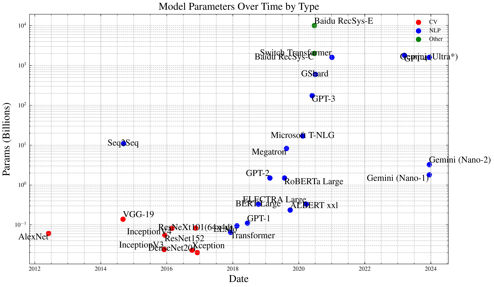

# Memory Footprint and FLOPs for SOTA Models in CV/NLP/Speech

This is a repository with the data used for the [AI and Memory Wall paper](https://arxiv.org/pdf/2403.14123.pdf). We report the number of paramters, feature size, as well as the total FLOPs for inference/training for SOTA models in CV, Speech Learning, and NLP. 

Example after running `./src/plot_parameters_vs_time.py`



## NLP Models
We mostly focus on calculating the different metrics for transformer models, starting from the original BERT FLOPs for training/inference, as well as its parameters and memory footprint. We then calculate the same metrics for different BERT variations as reported in the table below.

P.S: The total PFLOPs required to train each model, is calculated by using the setup reported in each paper.


|    Date    |      Model      | Token Size |   #Params   | #Features | Inference GFLOPs | Training PFLOPs |
|------------|-----------------|------------|-------------|-----------|------------------|-----------------|
| 09/10/2014 | Seq2Seq         |            |             |           |                  | 11,000          |
| 12/06/2017 | Transformer     | 512        | 65M         | 77M       | 54               | 23,000          |
| 02/15/2018 | ELMo            |            | 94M         |           |                  | 3,300           |
| 10/11/2018 | BERT Large      | 512        | 330M        | 230M      | 340              | 250,000         |
| 06/11/2018 | GPT-1           | 512        | 110M        | 85M       | 96               | 57,000          |
| 02/14/2019 | GPT-2           | 1024       | 1,500M      | 2,000M    | 3,400            |                 |
| 07/26/2019 | RoBERTa Large   | 512        | 1,500M      | 2,000M    | 3,400            | 4,300,000       |
| 08/17/2019 | Megatron        | 1024       | 8,300M      | 4,700M    | 18,000           | 8,100,000       |
| 09/26/2019 | ALBERT xxl      | 512        | 235M        | 450M      | 2,500            | 31,000,000      |
| 02/13/2020 | Microsoft T-NLG | 1024       | 17,000M     | 5,700M    | 36,000           | 28,000,000      |
| 03/23/2020 | ELECTRA Large   | 128        | 330M        | 38M       | 79               | 3,100,000       |
| 05/28/2020 | GPT-3           | 2048       | 175,000M    | 63,000M   | 740,000          | 310,000,000     |
| 06/30/2020 | GShard          |            | 600,000M    |           |                  |                 |
| 06/20/2020 | Baidu RecSys-C  | N/A        | 2,000,000M  | N/A       | ~O(0.1)          | N/A             |
| 06/20/2020 | Baidu RecSys-E  | N/A        | 10,000,000M | N/A       | ~O(0.1)          | N/A             |
| 01/01/2021 | Switch Transformer | N/A     | 1,600,000M  | N/A       | N/A              | N/A             |
| 03/14/2023 | GPT-4           | 8192       | 1,800,000M  | N/A       | 128GPUs          | 21,500,000,000  |
| 12/14/2023 | Gemini (Ultra)  | 128,000    | 1,600,000M  | N/A       | 128GPUs          | GPT-4x100 (2024)|


## CV Models
The table below reports the different metrics for various SOTA vision models, including the input image resolution, the number of parameters, the total inference GFLOPs, as well as the total PFLOPs required to train each model.

|    Date    |       Model       | Input Resolution | #Params | Inference GFLOPs | Training PFLOPs |
|------------|-------------------|------------------|---------|------------------|-----------------|
| 06/01/2012 | AlexNet           | 227 x 227        | 61M     |              1.4 | 460             |
| 09/04/2014 | VGG-19            | 224 x 224        | 138M    |               39 | 11,000          |
| 12/02/2015 | InceptionV3       | 299 x 299        | 24M     |              5.7 | 100,000         |
| 12/10/2015 | ResNet152         | 224 x 224        | 55M     |               23 | 11,000          |
| 02/26/2016 | InceptionV4       | 299 x 299        | 82M     |             24.6 |                 |
| 10/07/2016 | Xception          | 299 x 299        | 23M     |               17 | 450,000         |
| 11/16/2016 | ResNeXt101(64x4d) | 224 x 224        | 83M     |               31 | 12,000          |
| 12/03/2016 | DenseNet201       | 224 x 224        | 20M     |              8.9 | 2,800           |


# Memory Breakdown
The table below report the breakdown of memory required to train different SOTA models throughout the years. These include the total memory required to store the parameters, the memory footrpint associated with the optimization algorihtm, as well as the activation/feature memory.

| Year |         Model         | Input Resolution (Sentence length) | Batch Size | Params Memory | Optimizer Memory | Activation Memory | Total Memory |
|------|-----------------------|------------------------------------|------------|---------------|------------------|-------------------|--------------|
| 2012 | AlexNet               | 227 x 227                          |        128 | 0.23 GB       | 0.23 GB          | 0.71 GB           | 1.71 GB      |
| 2014 | VGG19                 | 224 x 224                          |         64 | 0.54 GB       | 0.54 GB          | 4.64 GB           | 5.72 GB      |
| 2015 | ResNet152             | 224 x 224                          |         32 | 0.22 GB       | 0.22 GB          | 5.14 GB           | 5.58 GB      |
| 2016 | DenseNet201           | 224 x 224                          |         32 | 0.07 GB       | 0.07 GB          | 6.04 GB           | 6.18 GB      |
| 2016 | ResNeXt101 (64x4d)    | 224 x 224                          |         32 | 0.31 GB       | 0.31 GB          | 7.34 GB           | 7.96 GB      |
| 2017 | Transformer Big (WMT) | 512                                |          6 | 1.02 GB       | 2.04 GB          | 11.78 GB          | 14.84 GB     |
| 2018 | BERT Large            | 512                                |         16 | 1.32 GB       | 2.64 GB          | 14.38 GB          | 18.34 GB     |
| 2019 | GPT-2                 | 2014                               |          1 | 5.86 GB       | 11.62 GB         | 8.63 GB           | 26.21 GB     |


# Acknowledgments
We appreciate it if you would please cite the following paper if you found the library useful for your work:

```text
Gholami A, Yao Z, Kim S, Mahoney MW, Keutzer K. AI and Memory Wall. RiseLab Medium Blog Post, University of Califonia Berkeley, 2021, March 29.
```

```text
@article{gholami2020ai_and_memory_wall,
  title={AI and Memory Wall},
  author={ Gholami, Amir and Yao, Zhewei and Kim, Sehoon and Hooper, Coleman and Mahoney, Michael W, and Keutzer, Kurt},
  journal={IEEE Micro Journal},
  year={2024}
}
```
